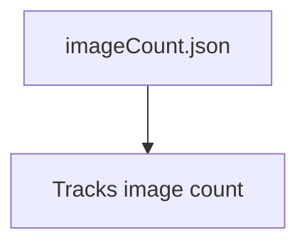

# Moodify 🎵😊


---


## 🚀 Live Demo
- 🌐 [Moodify Live Website](https://moodify4u.azurewebsites.net)
- 🔗 [https://moodify4u.azurewebsites.net](https://moodify4u.azurewebsites.net)

---

## 📸 Screenshots
### 1. Music Recommendation UI


### 2. Emotion Detection & Song Suggestion


---

## 📝 Overview
Moodify is an advanced web application that leverages AI-powered facial emotion recognition to recommend and play music that matches your current mood. Built with TensorFlow.js, face-api.js, and Express.js, Moodify provides a seamless, interactive experience for users to detect their emotions in real-time and enjoy mood-based music recommendations.


## 📚 Table of Contents
- ✨ [Features](#features)
- 🗂️ [Project Structure](#project-structure)
- 🔄 [Data Flow & Architecture](#data-flow--architecture)
- 🖼️ [Diagrams](#diagrams)
- 🛠️ [Installation](#installation)
- 🎮 [Usage](#usage)
- 🔌 [API Endpoints](#api-endpoints)
- 📄 [License](#license)


## ✨ Features
- 😀 Real-time facial emotion detection using webcam
- 🎶 AI-powered music recommendations based on detected mood
- ⏯️ Interactive music player with play, next, previous, and progress controls
- 📱 Responsive UI with modern design
- 🖼️ Image capture and storage for detected emotions
- 🌐 RESTful API for image management


```
├── Dockerfile
├── imageCount.json
├── index.js                # Express.js backend server
├── package.json
├── LICENSE
├── README.md
├── public/
│   ├── face-api.min.js     # Face API library
│   ├── index.html          # Main web UI
│   ├── music.css           # Music player styles
│   ├── music.js            # Music player logic
│   ├── script.js           # Main app logic (emotion detection, UI)
│   ├── assets/
│   │   └── images/
│       ├── face_expression_model-weights_manifest.json
```


<!-- Mermaid diagram removed due to GitHub rendering limitations. See documentation for supported syntax. -->


### Data Flow Steps
2. 🧠 **Face Detection**: face-api.js detects faces and landmarks.
3. 😊 **Emotion Recognition**: AI model predicts user's emotion.
4. 🖥️ **UI Update**: Detected emotion is displayed with emoji and text.
5. 🎵 **Music Recommendation**: App fetches mood-based songs from iTunes API.
7. 🖼️ **Image Capture**: Captures webcam image when emotion is detected.
8. 🌐 **Express.js Backend**: Handles image saving and retrieval via REST API.


### 1. Component Diagram
```mermaid
flowchart LR
        UI[💻 HTML/CSS/JS]
        FaceAPI[🧠 face-api.js]

        Storage[💾 File System]
    end
    UI --> FaceAPI
    UI --> MusicPlayer
    UI -->|REST API| Express
    Express --> Storage
```

### 2. Sequence Diagram
sequenceDiagram
    participant User
    Browser->>FaceAPI: Start webcam & detect emotion
    Browser->>iTunesAPI: Fetch songs for emotion
    iTunesAPI->>Browser: Return song list
```
### 3. Data Storage Diagram


---


1. **Clone the repository**


### 2. Emotion Detection & Song Suggestion

---
    npm install
    ```
3. **Run the server**
    ```sh
    npm start
    ```
4. **Open in browser**
    Visit [http://localhost:8000](http://localhost:8000)

---

## 🎮 Usage
- 📷 Grant webcam access when prompted.
- 😊 View detected emotion and emoji in the UI.
- ▶️ Click the play button to get mood-based music recommendations.
- ⏯️ Use music player controls to play, pause, skip tracks.
- 🖼️ Images are captured and stored for each detected emotion.

---

## 🔌 API Endpoints
- `GET /get-image-count` — Returns the number of saved images.
- `GET /get-images` — Returns list of saved images.
- `POST /save-image` — Saves a base64-encoded image.

---

## 📄 License
This project is licensed under the MIT License. See [LICENSE](LICENSE) for details.

---

## 👤 Author
Developed by [Shashank Trivedi](https://github.com/strivedi4u)

---

## 🌐 Follow & Connect
- [](https://github.com/strivedi4u)
- 💼 [LinkedIn](https://www.linkedin.com/in/shashanktrivedi)
- 🐦 [Twitter](https://twitter.com/strivedi4u)

---

## 🤝 Contributing
Pull requests are welcome! For major changes, please open an issue first to discuss what you would like to change.

---

## 🙏 Acknowledgements
- [face-api.js](https://github.com/justadudewhohacks/face-api.js)
- [TensorFlow.js](https://www.tensorflow.org/js)
- [Bootstrap](https://getbootstrap.com/)
- [iTunes Search API](https://affiliate.itunes.apple.com/resources/documentation/itunes-store-web-service-search-api/)
