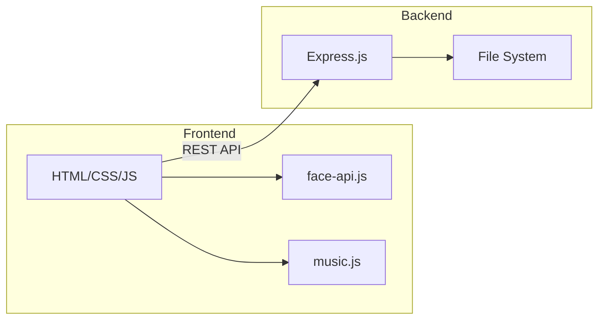
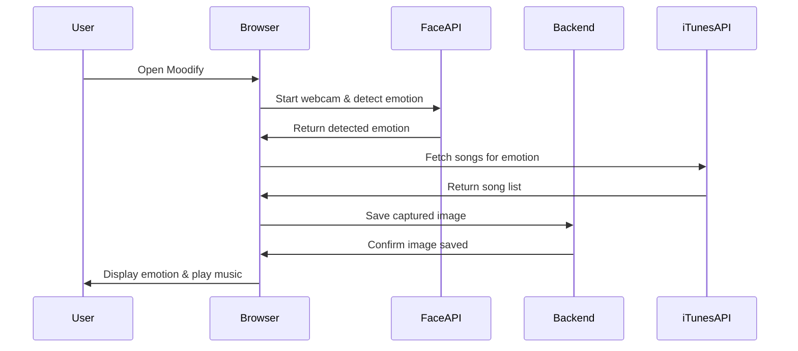
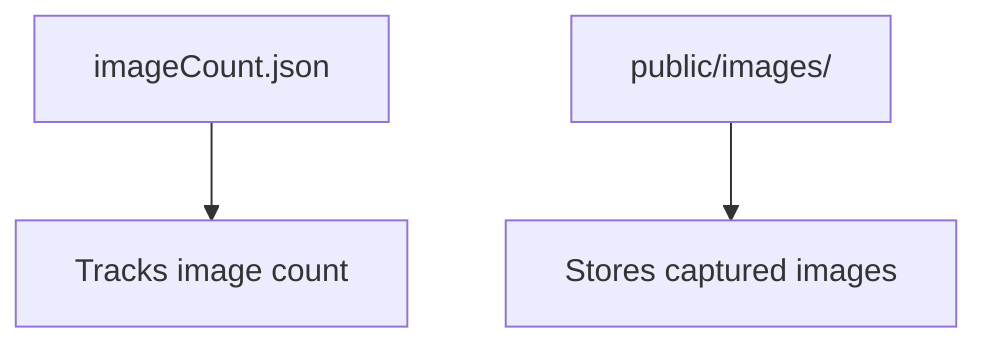

# Moodify

## Overview
Moodify is an advanced web application that leverages AI-powered facial emotion recognition to recommend and play music that matches your current mood. Built with TensorFlow.js, face-api.js, and Express.js, Moodify provides a seamless, interactive experience for users to detect their emotions in real-time and enjoy mood-based music recommendations.

---

## Table of Contents
- [Features](#features)
- [Project Structure](#project-structure)
- [Data Flow & Architecture](#data-flow--architecture)
- [Diagrams](#diagrams)
- [Installation](#installation)
- [Usage](#usage)
- [API Endpoints](#api-endpoints)
- [License](#license)

---

## Features
- Real-time facial emotion detection using webcam
- AI-powered music recommendations based on detected mood
- Interactive music player with play, next, previous, and progress controls
- Responsive UI with modern design
- Image capture and storage for detected emotions
- RESTful API for image management

---

## Project Structure
```
├── Dockerfile
├── imageCount.json
├── index.js                # Express.js backend server
├── package.json
├── LICENSE
├── README.md
├── public/
│   ├── face-api.min.js     # Face API library
│   ├── index.html          # Main web UI
│   ├── music.css           # Music player styles
│   ├── music.js            # Music player logic
│   ├── script.js           # Main app logic (emotion detection, UI)
│   ├── user.html           # User profile (optional)
│   ├── assets/
│   │   └── images/
│   │       ├── bg.avif     # Background image
│   │       └── logo.png    # App logo
│   ├── images/             # Saved user images
│   └── models/             # Face detection & emotion models
│       ├── face_expression_model-shard1
│       ├── face_expression_model-weights_manifest.json
│       ├── ...
```

---

## Data Flow & Architecture

```mermaid
flowchart TD
    A[User Webcam] --> B[Face Detection (face-api.js)]
    B --> C[Emotion Recognition]
    C --> D[UI Update]
    D --> E[Music Recommendation]
    E --> F[Music Player]
    C --> G[Image Capture]
    G --> H[Express.js Backend]
    H --> I[Image Storage]
```

### Data Flow Steps
1. **User Webcam**: User grants access to webcam.
2. **Face Detection**: face-api.js detects faces and landmarks.
3. **Emotion Recognition**: AI model predicts user's emotion.
4. **UI Update**: Detected emotion is displayed with emoji and text.
5. **Music Recommendation**: App fetches mood-based songs from iTunes API.
6. **Music Player**: User can play, skip, or pause recommended tracks.
7. **Image Capture**: Captures webcam image when emotion is detected.
8. **Express.js Backend**: Handles image saving and retrieval via REST API.
9. **Image Storage**: Images are stored in `public/images/` and tracked in `imageCount.json`.

---

## Diagrams

### 1. Component Diagram


### 2. Sequence Diagram


### 3. Data Storage Diagram


---

## Installation

1. **Clone the repository**
   ```sh
   git clone https://github.com/strivedi4u/moodify.git
   cd moodify


## Screenshots
[Access Moodify Live](https://moodify4u.azurewebsites.net)


### 2. Emotion Detection & Song Suggestion


---
   ```
2. **Install dependencies**
   ```sh
   npm install
3. **Run the server**
   ```sh
- Grant webcam access when prompted.
- View detected emotion and emoji in the UI.
- Click the play button to get mood-based music recommendations.
- Use music player controls to play, pause, skip tracks.
- Images are captured and stored for each detected emotion.

---

## API Endpoints
- `GET /get-image-count` — Returns the number of saved images.
- `GET /get-images` — Returns list of saved images.
- `POST /save-image` — Saves a base64-encoded image.

---

## License
This project is licensed under the MIT License. See [LICENSE](LICENSE) for details.

---

## Author
Developed by [Shashank Trivedi](https://github.com/strivedi4u)

---

## Follow & Connect
- [GitHub](https://github.com/strivedi4u)
- [LinkedIn](https://www.linkedin.com/in/shashanktrivedi)
- [Twitter](https://twitter.com/strivedi4u)

---

## Contributing
Pull requests are welcome! For major changes, please open an issue first to discuss what you would like to change.

---

## Acknowledgements
- [face-api.js](https://github.com/justadudewhohacks/face-api.js)
- [TensorFlow.js](https://www.tensorflow.org/js)
- [Bootstrap](https://getbootstrap.com/)
- [iTunes Search API](https://affiliate.itunes.apple.com/resources/documentation/itunes-store-web-service-search-api/)
